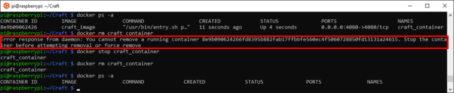

# [atet](https://github.com/atet) / [learn](https://github.com/atet/learn#atet--learn) / [**_virtual_**](https://github.com/atet/learn/blob/master/virtual/README.md#atet--learn--virtual)

[](#nolink)

# Introduction to Virtualization

**This tutorial is part of my series on System Administration:<br>I highly recommend finishing my<br>[15 Minute Introduction to Raspberry Pi](https://github.com/atet/learn/blob/master/raspberrypi/README.md#atet--learn--raspberrypi) and<br>[15 Minute Introduction to Network Attached Storage](https://github.com/atet/learn/blob/master/nas/README.md#atet--learn--nas)<br>to put the goals of this tutorial in a realistic context**

**Estimated time to completion: 15 minutes**<br>(excluding waiting times for downloads and updates)

* This introduction to virtualization only covers what's absolutely necessary to get you up and running
* You are here because **you're tired of reinstalling operating systems and waiting for updates** when something goes wrong
* We will be using the free and open source Docker framework on the $10 Raspberry Pi Zero W

--------------------------------------------------------------------------------------------------

## Table of Contents

### Introduction

* [0. Requirements](#0-requirements)
* [1. Pi: Installation, Connection, Update](#1-pi-installation-connection-update)
* [2. Game Plan](#2-game-plan)
* [3. Docker Installation and Setup](#3-docker-installation-and-setup)
* [4. Your First Container](#4-your-first-container)
* [5. Craft Container](#5-craft-container)
* [6. Nextcloud Container](#6-nextcloud-container)
* [7. Epilogue](#7-epilogue)
* [8. Next Steps](#8-next-steps)

### Supplemental

* [`Dockerfile`s](#dockerfiles)
* [Need More Containers?](#need-more-containers)
* [Other Resources](#other-resources)
* [Troubleshooting](#troubleshooting)
* [Acknowledgments](#acknowledgments)

--------------------------------------------------------------------------------------------------

## 0. Requirements

**If you have completed the first two tutorials, you have already met these requirements**

### Command Line Terminal

* Windows: This tutorial was developed on Microsoft Windows 10 with Windows Subsystem for Linux (WSL)
* MacOS: [Your Terminal program is Bash](https://en.wikipedia.org/wiki/Terminal_(macOS))
* Linux: I recommend Ubuntu 18.04 LTS

### Computer Hardware

* The $10 Raspberry Pi Zero W ("wireless")
* Cell phone charger (5V) with micro USB
* ≥8 GB microSD card

### WiFi Network

**The Raspberry Pi Zero W has specific WiFi requirements:**

* 2.4 GHz b/g/n WiFi-only
* Connect to WiFi using only the network name (a.k.a. SSID) and password
* Disabled ["wireless isolation" (a.k.a. AP isolation, station isolation, or client isolation)](https://www.howtogeek.com/179089/lock-down-your-wi-fi-network-with-your-routers-wireless-isolation-option/)
* Broadband internet connection (≥10 Mbps)

**Once you have everything here, you're ready to go!**

[Back to Top](#table-of-contents)

--------------------------------------------------------------------------------------------------

## 1. Pi: Installation, Connection, Update

**Even if you have completed the first two tutorials, I highly recommend you start over from scratch**

* Please follow sections 2 and 4 in [Atet's 15 Minute Introduction to Raspberry Pi](https://github.com/atet/learn/blob/master/raspberrypi/README.md#atet--learn--raspberrypi) to setup your Pi:

   2. [Installation](https://github.com/atet/learn/tree/master/raspberrypi#2-installation)
   3. [Connection](https://github.com/atet/learn/tree/master/raspberrypi#3-connection)
   4. [Updating](https://github.com/atet/learn/tree/master/raspberrypi#4-updating)

* If you have any issues, please see [Troubleshooting for Raspberry Pi](https://github.com/atet/learn/tree/master/raspberrypi#troubleshooting)
* Take note of your Raspberry Pi's current IP address for later

[Back to Top](#table-of-contents)

--------------------------------------------------------------------------------------------------

## 2. Game Plan

**Recall from the previous tutorials where we made a fun multiplayer Craft server and a Nextcloud file server**

* You had to _wait_ while burning the OS, _wait_ for OS install, _wait_ for updates, _wait_ while installing dependencies, _wait_ _wait_ _wait_...
* If you were _lucky_ enough to make a mistake and start over, you would've experienced the joys of.. **_more coffee breaks_**

**This tutorial will setup your Pi Zero to quickly install and configure programs through _virtualization_, where:**

* Mistakes won't permanently affect your Pi's operating system
* How you install and configure programs are precisely written out as a document
* You can use pre-made instructions to get a head start on installing programs and their dependencies

[Back to Top](#table-of-contents)

--------------------------------------------------------------------------------------------------

## 3. Docker Installation and Setup

**To quickly install and manage programs through virtualization, we will use the Docker framework**

### 3.1. Add Docker repository

* Log into your Raspberry Pi Zero W from your computer:

[](#nolink)

* Add a security key to allow you to download from the official Docker repository:

```
$ curl -fsSL https://download.docker.com/linux/$(. /etc/os-release; echo "$ID")/gpg | \
  sudo apt-key add - && \
  echo "deb [arch=armhf] https://download.docker.com/linux/$(. /etc/os-release; echo "$ID") \
  $(lsb_release -cs) stable" | \
  sudo tee /etc/apt/sources.list.d/docker.list && \
  sudo apt-key fingerprint 0EBFCD88
```

* Verify that the key's fingerprint is "`9DC8 5822 9FC7 DD38 854A E2D8 8D81 803C 0EBF CD88`"

[](#nolink)

### 3.1. Docker installation

* Install the following dependencies and Docker:
   * Coffee break: This will take ~10 mins. and you don't need to babysit this

```
$ sudo apt update && \
  sudo apt install -y \
     apt-transport-https \
     ca-certificates \
     curl \
     gnupg2 \
     software-properties-common && \
  sudo apt install -y --no-install-recommends \
     docker-ce \
     cgroupfs-mount
```

### 3.2. Docker Setup

* Add the default user "`pi`" to the "`docker`" permissions group and log out for the change to take effect running `sudo usermod -aG docker $USER && exit`
* **This will log you out**, just log back into your Pi

```
$ sudo usermod -aG docker $USER && exit

logout
Connection to <PI'S IP ADDRESS> closed.

$ ssh pi@<PI'S IP ADDRESS>
```

* Once you log back in, you must start the Docker service

```
$ sudo systemctl enable docker && \
  sudo systemctl start docker
```

* Once this runs without errors, you can move on to the next section

[](#nolink)

[Back to Top](#table-of-contents)

--------------------------------------------------------------------------------------------------

## 4. Your First Container

> **A container is the virtual simulation of another computer _within_ your computer**
>
> [](#nolink)

### 4.1. Download and run

* Each computer that Docker virtualizes is called a "container"
* The following command will start a simulation of a barebones Linux computer on your Pi that will just **print out a message for you**:

```
$ docker run --name my_first_container hypriot/armhf-hello-world
```

> [](#nolink)
>
> You can see the message of "`Hello from Docker.`" in your console coming from the virtualized Linux computer within your Pi

### 4.2. Check status

* You can check what containers you have made by running the following:

```
$ docker ps -a
```

* For Docker to make this container, an "image" of the barebones Linux installation had to be downloaded
* You can check what images you've downloaded by running the following:

```
$ docker images -a
```

* Note that both containers and images are identified by names:
   * We gave our container the name of "`my_first_container`" using the "`--name`" flag
   * The image we downloaded can be identified by "`hypriot/armhf-hello-world`"

[](#nolink)

### 4.3. Cleanup

* Since we don't need the container or the image for the rest of this tutorial, we can **delete them to regain disk space**:

```
$ docker rm my_first_container
$ docker rmi hypriot/armhf-hello-world
```

* Confirm deletion by running "`docker ps -a && docker images -a`" and checking that the results are empty

[](#nolink)

**Congratulations!**

* You have run your first Docker container
* Now let's see how useful Docker can really be in the next two sections

[Back to Top](#table-of-contents)

--------------------------------------------------------------------------------------------------

## 5. Craft Container

**If you recall from my [15 Minute Introduction to Raspberry Pi](https://github.com/atet/learn/blob/master/raspberrypi/README.md#atet--learn--raspberrypi), we made a Craft multiplayer game server**

### 5.1. `Dockerfile`

* We'll use Docker to automatically build the same Craft server using just a list of instructions
* These instructions are put into a "`Dockerfile`"
* Let's make a new directory and download this file from my GitHub:

```
$ cd ~ && mkdir Craft && cd ~/Craft && \
  wget https://raw.githubusercontent.com/atet/learn/master/virtual/Craft/Dockerfile
```

### 5.2. Image build

* Now that we have the instructions, let's build the image by running this next command:
   * Coffee break #2: This will take 15 mins. to build, but you can review the next point which talks about the anatomy of a `Dockerfile` while you wait

```
$ docker image build -t craft_image .
```

**While Docker builds the image, let's look at a
 `Dockerfile`**

* This file basically lists out all the commands we ran in the other tutorial with a few extra Docker syntax (e.g. "`FROM`",  "`RUN`", etc.)
* A brief description of each section of commands:

> [](#nolink)
> 
> 1. "`FROM`" is a base image that this new image will start off from
> 2. Downloading all the dependencies
> 3. Downloading Craft files from GitHub
> 4. Building the Craft server program
> 5. Making a change to the "`server.py`" file
> 6. "`EXPOSE`" will allow the outside world to communicate to the container
> 7. "`CMD`" will run the "`server.py`" program
>
> **NOTE**: This is the earlier version of the Craft `Dockerfile` that took 50 mins. to build, the current version is different and takes only 10 mins.

### 5.3. Deploy container

* Once the image is done building, we will deploy a container based on "`craft_image`":

```
$ docker run -d -p 4080:4080 --name craft_container craft_image
```

* **Did anything happen?** I just got a bunch of random characters?
* Run "`docker ps -a`" and you'll see that the "`STATUS`" is that the container is "`UP`" and running

[](#nolink)

### 5.4. Connect to Craft server

* You can now connect to the `craft_container` by the Pi's IP address like you did in the previous tutorial:
   1. Download and extract Craft client game
   2. Run game
   3. Connect to the Pi's Craft multiplayer server that you just made in Docker (a.k.a. the `craft_container`) within the game
   * [Click here if you need to go through the Craft client tutorial again](https://github.com/atet/learn/tree/master/raspberrypi#6-craft-client)

[](#nolink)

### 5.5. Cleanup

* Once you're done playing some Craft, let's erase this container for now (this won't erase the underlying image you built)

```
$ docker rm craft_container
```

* **Oh no!** Looks like we can't erase an actively running container
* Unlike our first container that just printed out "`Hello from Docker.`" and shut itself down, `craft_container` will remain active
* Let's stop the container first, then erase it (and confirm it's gone):

```
$ docker stop craft_container
$ docker rm craft_container
$ docker ps -a
```

[](#nolink)

[Back to Top](#table-of-contents)

--------------------------------------------------------------------------------------------------

## 6. Nextcloud Container

**If you recall from my [15 Minute Introduction to Network Attached Storage](https://github.com/atet/learn/blob/master/nas/README.md#atet--learn--nas), we made a Nextcloud file server**

### 6.1. `Dockerfile`

* We'll use Docker to automatically build the same Nextcloud server using a "`Dockerfile`"
* Let's make a new directory and download this file from my GitHub:
   * Remember: This file must be named "`Dockerfile`", so it's best practice to separate them by directories (e.g. different directories for Craft and Nextcloud)

```
$ cd ~ && mkdir Nextcloud && cd ~/Nextcloud && \
  wget https://raw.githubusercontent.com/atet/learn/master/virtual/Nextcloud/Dockerfile
```

### 6.2. Image build

* Now that we have the instructions, let's build the image:
   * Coffee break #3: This will take 15 mins. to build, but you can review the next point which talks saving time with layers

```
$ docker image build -t nextcloud_image .
```

**While Docker builds the image, let's talk about "`layers`"**

* _Did you notice that the first few `Dockerfile` commands ran almost instantaneously?_
* That's because the previous Craft image build already downloaded the base image and ran the same first four commands
* **Docker will keep these layers to save time**: This probably shaved off a good 10 minutes!

> [](#nolink)
>
> **NOTE**: This is the earlier version of the Nextcloud `Dockerfile`, the current version's build process will look different

### 6.3. Deploy container

* Once the image is done building, we will deploy a container named "`nextcloud_container`" based on "`nextcloud_image`" we built:

```
$ docker run -d -p 80:80 --name nextcloud_container nextcloud_image
```

### 6.4. Connect to Nextcloud server

* You can now connect to the `nextcloud_container` by the Pi's IP address from your web browser to setup Nextcloud
   * Reminder: you have erased the previous Nextcloud installation from the previous tutorial to start over
   * Choose a username and password for the Nextcloud administrator account (can be the same as the previous tutorial)
   * Data Folder: Leave as default "/var/lib/nextcloud/data"
   * Database user: "ncuser"
   * Database password: "password"
   * Database name: "nextcloud"
   * Database host: "localhost"

[](#nolink)

* **Trying to setup the same way as before produced an error!**
* Looks like we never actually setup the MariaDB database like we did in the previous tutorial
* **We must shut down and erase** the `nextcloud_container` before we move on:

> ```
> $ docker stop nextcloud_container && \
>   docker rm nextcloud_container
> ```
> 
> **IMPORTANT**: Shut down and erase the `nextcloud_container` before moving on

### 6.5. "_One service per container_"

> Docker best practice is to "containerize" individual services separately (e.g. web server, database, etc.)
> 
> [](#nolink)

* Let's run a separate MariaDB container from my Docker Hub:

```
$ docker run -d --name mariadb_container atetkao/mariadb_image:latest
```

[](#nolink)

* Now that the previous `nextcloud_container` is erased, we will make a new one that "links" to the `mariadb_container`:

```
$ docker run -d -p 80:80 --name nextcloud_container --link mariadb_container nextcloud_image && \
  docker ps -a
```

[](#nolink)

* Now that we see both `nextcloud_container` and `mariadb_container` up and running, we can go back to our web browser and successfully finish the Nextcloud setup:
   * Use the same credentials above **BUT change database host to: "mariadb_container"**
   * Setup processing will take ~5 mins.

[](#nolink)

### 6.6. Cleanup

* You now have a fully functioning Nextcloud file server, but **don't use it for real quite yet!**
   * **WARNING: Any files saved on this Nextcloud container will be erased when the containers shut down!**
   * There are a few more bits and pieces to make data persistent which won't be covered here
* Before we shut everything down, let's start a Craft container in addition to Nextcloud for fun:

```
$ docker run -d -p 4080:4080 --name craft_container craft_image
```
[](#nolink)

**Wow, not bad for a $10 computer to be running all this!**

* Let's shut everything down for the night:

```
$ docker ps -a && \
  docker stop $(docker ps -a -q) && \
  docker rm $(docker ps -a -q) && \
  docker ps -a
```

[](#nolink)

[Back to Top](#table-of-contents)

--------------------------------------------------------------------------------------------------

## 7. Epilogue

* I hope the practical experience from my three tutorials using the Raspberry Pi illuminates how useful Docker can be:
   * Quickly use other's known working configurations
   * Test different configurations of your "stack" of services without affecting the host computer; e.g. Nextcloud needed **L**inux + **A**pache + **M**ariaDB + **P**HP = **LAMP** stack
* Although you can set up the Nextcloud container to persist data, for the most part, Docker containers are meant to be "ephemeral" (i.e. they do their thing and then disappear)

> [](#nolink)
> 
> _Mr. Meeseeks<sup>[[2]](#acknowledgments)</sup> are summoned to perform a single job and disappear_

* We ran multiple containers in the last section; just know that if the service you're containerizing needs to connect to the "outside" (e.g. the Apache webserver needs to serve webpages to your browser), **it must be using an unassigned port**:

> [](#nolink)
>
> _The three containers are each using unique ports: 4080, 80, and 3306_

[Back to Top](#table-of-contents)

--------------------------------------------------------------------------------------------------

## 8. Next Steps

**We touched on a bunch of different IT tasks here; you're easily on your way to becoming a self-sufficient ["techie"](https://www.merriam-webster.com/dictionary/techie), it just takes a lot of experimenting and completing projects like this**

* Try this tutorial one more time to solidify these concepts
* See how many containers you can run on your Pi Zero
* Explore more advanced topics such as [persisting data with volumes](https://docs.docker.com/storage/volumes/)
* Read [more about `Dockerfiles`](https://docs.docker.com/v17.09/engine/userguide/eng-image/dockerfile_best-practices/)

[Back to Top](#table-of-contents)

--------------------------------------------------------------------------------------------------

## `Dockerfile`s

**A quick recap on `Dockerfile`s**

### A. The anatomy of a `Dockerfile`

* These files must be named "`Dockerfile`", so if you have multiples, organize them by differently named directories
* They list out all the commands we ran in the other tutorials with a few extra Docker syntax (e.g. "`FROM`",  "`RUN`", etc.)
* A brief description of each section of commands from Craft server's `Dockerfile`:

> [](#nolink)
> 
> 1. "`FROM`" is a base image that this new image will start off from
> 2. Downloading all the dependencies
> 3. Downloading Craft files from GitHub
> 4. Building the Craft server program
> 5. Making a change to the "`server.py`" file
> 6. "`EXPOSE`" will allow the outside world to communicate to the container
> 7. "`CMD`" will run the "`server.py`" program
>
> **NOTE**: This is an earlier version of the Craft `Dockerfile`, the current version has less instructions because it pulls a pre-built version of Craft

### B. Layers

* Docker will reuse the same images and layers to save time
* We've seen this when we built the Nextcloud image after the Craft image:

[](#nolink)

[Back to Top](#table-of-contents)

--------------------------------------------------------------------------------------------------

## Need More Containers?

* The Raspberry Pi Zero is amazing for its price point, [but it's not going to run a million containers](https://www.raspberrypi.org/forums/viewtopic.php?t=159001)
* This brand has other more powerful computers if you need the horsepower, or you can look into **Docker Swarm** to cluster together multiple Pi Zeros: https://blog.hypriot.com/post/how-to-setup-rpi-docker-swarm/

[](#nolink)

[Back to Top](#table-of-contents)

--------------------------------------------------------------------------------------------------

## Share Your Build!

**There are several ways to share your builds to help your community**

### GitHub

* Just like the first couple `Dockerfile`s you used, they were simply hosted on my GitHub, e.g. https://raw.githubusercontent.com/atet/learn/master/virtual/Craft/Dockerfile
* Easy as signing up for a free GitHub account and uploading your `Dockerfiles`

[](#nolink)

### Docker Hub

* This is a bit more involved since you're actually sending your built image to Docker Hub (like my `mariadb_image` you used in step [6.5. "_One service per container_"](#65-"one-service-per-container"))
* This will save others time since they won't have to do anything else but download the pre-built image
* Sign up for a free account at Docker Hub: https://hub.docker.com/
* Once you have a working `Dockerfile`, run these commands in the same directory:

```
$ docker login --username=<USERNAME> --password=<PASSWORD OR ACCESS TOKEN>
$ docker build -t <USERNAME>/<NAME YOU WANT TO GIVE IMAGE>:latest .
$ docker push <USERNAME>/<SAME IMAGE NAME AS ABOVE>:latest
```

[](#nolink)

[Back to Top](#table-of-contents)

--------------------------------------------------------------------------------------------------

## Other Resources

Description | Link
--- | ---
Official `Dockerfile` Best Practices | https://docs.docker.com/v17.09/engine/userguide/eng-image/dockerfile_best-practices/
Official Docker Images (for Pi Zero) | https://hub.docker.com/u/arm32v6/

[Back to Top](#table-of-contents)

--------------------------------------------------------------------------------------------------

## Troubleshooting

Issue | Solution
--- | ---
Docker seems to be frozen or hanging | Click on the terminal and press Enter a couple times, if that doesn't work, you may have to wait a while longer

[Back to Top](#table-of-contents)

--------------------------------------------------------------------------------------------------

## Acknowledgments

1. Docker CE (Community Edition), the free, open-source virtualization framework: https://www.docker.com/
2. Rick and Morty, Mr. Meeseeks © The Cartoon Network, Inc.

[Back to Top](#table-of-contents)

--------------------------------------------------------------------------------------------------

<p align="center">Copyright © 2019-∞ Athit Kao, <a href="http://www.athitkao.com/tos.html" target="_blank">Terms and Conditions</a></p>