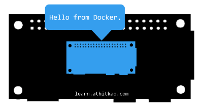

# [atet](https://github.com/atet) / [learn](https://github.com/atet/learn#atet--learn) / [**_virtual_**](https://github.com/atet/learn/blob/master/virtual/README.md#atet--learn--virtual)

[](#nolink)

# Introduction to Virtualization (INCOMPLETE)

**This tutorial is part of my series on System Administration:<br>I highly recommend finishing my<br>[15 Minute Introduction to Raspberry Pi](https://github.com/atet/learn/blob/master/raspberrypi/README.md#atet--learn--raspberrypi) and<br>[15 Minute Introduction to Network Attached Storage](https://github.com/atet/learn/blob/master/nas/README.md#atet--learn--nas)<br>to put the goals of this tutorial in a realistic context**

**Estimated time to completion: 15 minutes**<br>(excluding waiting times for downloads and updates)

* This introduction to virtualization only covers what's absolutely necessary to get you up and running
* You are here because **you're tired of reinstalling operating systems and waiting for updates** when something goes wrong
* We will be using the free and open source Docker framework on the $10 Raspberry Pi Zero W

--------------------------------------------------------------------------------------------------

## Table of Contents

### Introduction

* [0. Requirements](#0-requirements)
* [1. Pi: Installation, Connection, Update](#1-pi-installation-connection-update)
* [2. Game Plan](#2-game-plan)
* [3. Docker Installation and Setup](#3-docker-installation-and-setup)
* [4. Your First Container](#4-your-first-container)
* [5. Craft Container](#5-craft-container)
* [6. Nextcloud Container](#6-nextcloud-container)
* [7. Docker Files](#7-docker-files)
* [8. Epilogue](#8-epilogue)
* [9. Next Steps](#9-next-steps)

### Supplemental

* [Need More Containers?](#need-more-containers)
* [Other Resources](#other-resources)
* [Troubleshooting](#troubleshooting)
* [Acknowledgments](#acknowledgments)

--------------------------------------------------------------------------------------------------

## 0. Requirements

**You must set up your Raspberry Pi Zero W using the following instructions**

### Software

* Windows: This tutorial was developed on Microsoft Windows 10 with Windows Subsystem for Linux (WSL) and [Docker CE (Community Edition) v19.03.5](https://hub.docker.com/editions/community/docker-ce-server-debian)
* MacOS: [Your Terminal program is Bash](https://en.wikipedia.org/wiki/Terminal_(macOS))
* Linux: I recommend Ubuntu 18.04 LTS

### Computer Hardware

* This tutorial uses the $10 Raspberry Pi Zero W ("wireless")
* You will also need a 5V micro USB cell phone charger and ≥8 GB microSD card

### WiFi Network

**The Raspberry Pi Zero W has specific WiFi requirements:**

* 2.4 GHz b/g/n WiFi-only
* Connect to WiFi using only the network name (a.k.a. SSID) and password
* Disabled ["wireless isolation" (a.k.a. AP isolation, station isolation, or client isolation)](https://www.howtogeek.com/179089/lock-down-your-wi-fi-network-with-your-routers-wireless-isolation-option/)

**Once you have everything here, you're ready to go!**

[Back to Top](#table-of-contents)

--------------------------------------------------------------------------------------------------

## 1. Pi: Installation, Connection, Update

* Please follow sections 2 and 4 in [Atet's 15 Minute Introduction to Raspberry Pi](https://github.com/atet/learn/blob/master/raspberrypi/README.md#atet--learn--raspberrypi):

   2. [Installation](https://github.com/atet/learn/tree/master/raspberrypi#2-installation)
   3. [Connection](https://github.com/atet/learn/tree/master/raspberrypi#3-connection)
   4. [Updating](https://github.com/atet/learn/tree/master/raspberrypi#4-updating)

* If you have any issues, please see [Troubleshooting for Raspberry Pi](https://github.com/atet/learn/tree/master/raspberrypi#troubleshooting)
* Take note of your Raspberry Pi's current IP address for later

[Back to Top](#table-of-contents)

--------------------------------------------------------------------------------------------------

## 2. Game Plan

**Recall from the previous tutorials where we made a fun multiplayer Craft server and a Nextcloud file server**

* You had to _wait_ while burning the OS, _wait_ for OS install, _wait_ for updates, _wait_ while installing dependencies, _wait_ _wait_ _wait_...
* If you were lucky enough to make a mistake and start over, you would've experienced the joys of.. **more coffee breaks**

**This tutorial will setup your Pi Zero to quickly install and configure applications through virtualization with Docker, where:**

* Any mistakes will not permanently affect the Raspberry Pi's OS
* How you install and configure programs are precisely written out as a document
* You can use pre-made instructions to get a quick headstart or share your custom builds to help others

[Back to Top](#table-of-contents)

--------------------------------------------------------------------------------------------------

## 3. Docker Installation and Setup

**Log into your Raspberry Pi Zero W, these instructions are specific to this computer's hardware**

### 3.1. Add Docker repository

* Add a security key to allow you to download from the official Docker repository
* Verify that the key's fingerprint is "`9DC8 5822 9FC7 DD38 854A E2D8 8D81 803C 0EBF CD88`"

```
$ curl -fsSL https://download.docker.com/linux/$(. /etc/os-release; echo "$ID")/gpg | \
  sudo apt-key add - && \
  sudo apt-key fingerprint 0EBFCD88
```

[](#nolink)

* Add the Docker repository to your list of places to check for new programs to install

```
$ echo "deb [arch=armhf] https://download.docker.com/linux/$(. /etc/os-release; echo "$ID") \
  $(lsb_release -cs) stable" | \
  sudo tee /etc/apt/sources.list.d/docker.list
```

### 3.1. Dependencies

* Install the following dependencies:

```
$ sudo apt update && \
  sudo apt install -y \
     apt-transport-https \
     ca-certificates \
     curl \
     gnupg2 \
     software-properties-common
```

### 3.2. Docker Installation

```
$ sudo apt install -y --no-install-recommends \
    docker-ce \
    cgroupfs-mount
```

### 3.3. Docker Setup

* Add the default user "`pi`" to the "`docker`" permissions group and log out for the change to take effect running `sudo usermod -aG docker $USER && exit`
* **This will log you out**, just log back into your Pi

```
$ sudo usermod -aG docker $USER && exit

logout
Connection to <PI'S IP ADDRESS> closed.

$ ssh pi@<PI'S IP ADDRESS>
```

* Once you log back in, you need to start the Docker service

```
$ sudo systemctl enable docker && \
  sudo systemctl start docker
```

* Once this runs without errors, you can move on to the next section

[](#nolink)

[Back to Top](#table-of-contents)

--------------------------------------------------------------------------------------------------

## 4. Your First Container

* A container is the virtual simulation of another computer within your computer
* The following line will start a simulation of a barebones Linux computer that will just **print out a message for you**:

```
$ docker run --name my_first_container hypriot/armhf-hello-world
```

[](#nolink)

* You can check what containers you have made by running the following:

```
$ docker ps -a
```

* In order to make this container, Docker had to download an "image" of the barebones Linux installation
* You can check what images you have downloaded by running the following:

```
$ docker images -a
```

* Note that both containers and images are identified by names:
   * We gave our first container the name of "`my_first_container`" using the "`--name`" flag
   * The image we downloaded can be identified by "`hypriot/armhf-hello-world`"

[](#nolink)

* Since we don't need the container or the image for the rest of this tutorial, we can **delete them to regain disk space**:

```
$ docker rm my_first_container
$ docker rmi hypriot/armhf-hello-world
```

* Confirm deletion by running "`docker ps -a && docker images -a`" and checking that the results are empty

[](#nolink)

**Congratulations!**

* You have made your first Docker container
* Now let's see how useful Docker can really be in the next two sections

[Back to Top](#table-of-contents)

--------------------------------------------------------------------------------------------------

## 5. Craft Container

**If you recall from my [15 Minute Introduction to Raspberry Pi](https://github.com/atet/learn/blob/master/raspberrypi/README.md#atet--learn--raspberrypi), we made a Craft multiplayer game server**

* We'll use Docker to build the same Craft server using just a list of instructions
* These instructions are put into a "`Dockerfile`"
* Let's make a new directory to put the file in:

```
$ cd ~ && mkdir Craft && cd ~/Craft
```


* While Docker builds the image based on the `Dockerfile`, let's take a look at the file's instructions:

```
FROM balenalib/raspberry-pi-debian:buster
MAINTAINER Athit Kao (github.com/atet)
RUN printf "deb-src http://raspbian.raspberrypi.org/raspbian/ buster main contrib non-free rpi" >> \
   /etc/apt/sources.list
RUN apt-get update
RUN apt-get install -y apt-utils 
RUN apt-get install -y python-pip cmake libglew-dev xorg-dev libcurl4-openssl-dev doxygen git
RUN apt-get -y build-dep glfw
RUN python -m pip install requests
RUN git clone https://github.com/fogleman/Craft.git /usr/local/Craft
WORKDIR "/usr/local/Craft/"
RUN cmake -Wno-dev .
RUN make
RUN gcc -std=c99 -O3 -fPIC -shared -o world -I src -I \
   deps/noise \
   deps/noise/noise.c \
   src/world.c
RUN cp server.py server.py.BAK && \
   sed "s/AUTH_REQUIRED = True/AUTH_REQUIRED = False/" server.py.BAK > \
   server.py
EXPOSE 4080
CMD ["python", "./server.py"]
```

[Back to Top](#table-of-contents)

--------------------------------------------------------------------------------------------------

## 6. Nextcloud Container

* Since this file must be named "`Dockerfile`", it's best practice to make a separate descriptive directories if you have multiple

[Back to Top](#table-of-contents)

--------------------------------------------------------------------------------------------------

## 7. Docker Files

[Back to Top](#table-of-contents)

--------------------------------------------------------------------------------------------------

## 8. Epilogue

[Back to Top](#table-of-contents)

--------------------------------------------------------------------------------------------------

## 9. Next Steps


[Back to Top](#table-of-contents)

--------------------------------------------------------------------------------------------------

## Need More Containers?

* The Raspberry Pi Zero is amazing for its price point, [but it's not going to run multiple containters](); this brand has other more powerful and more expensive computers if you need the horsepower

> [](#nolink)
>
> 

[Back to Top](#table-of-contents)

--------------------------------------------------------------------------------------------------

## Other Resources

Description | Link
--- | ---
Official Raspberry Pi Help | https://www.raspberrypi.org/help/
Official Raspberry Pi Getting Started Guide | https://projects.raspberrypi.org/en/pathways/getting-started-with-raspberry-pi
Official Raspberry Pi Project Ideas | https://projects.raspberrypi.org/en/

[Back to Top](#table-of-contents)

--------------------------------------------------------------------------------------------------

## Troubleshooting

Issue | Solution
--- | ---

[Back to Top](#table-of-contents)

--------------------------------------------------------------------------------------------------

## Acknowledgments

1. Docker CE (Community Edition), the free, open-source virtualization framework: https://www.docker.com/

[Back to Top](#table-of-contents)

--------------------------------------------------------------------------------------------------

<p align="center">Copyright © 2019-∞ Athit Kao, <a href="http://www.athitkao.com/tos.html" target="_blank">Terms and Conditions</a></p>